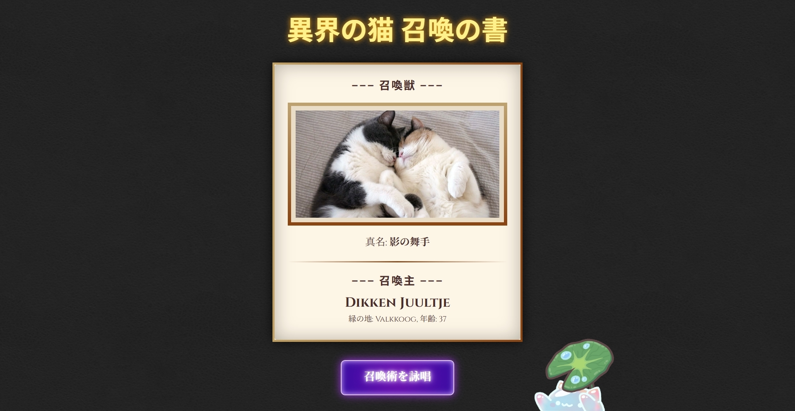

# 📜 Grimoire of Feline Summoning 📜
**(異界の猫 召喚の書)**

  

  <i>"このデジタルな魔導書のページをめくり、 異界より猫の使い魔を現世へと呼び覚まさん──"</i>

***

## 📖 この魔導書について (About This Grimoire)

ここから遊べます⇒https://imshota1009.github.io/nyan-book/

`Grimoire of Feline Summoning`は、古代の召喚術を現代のウェブ技術で再現した神秘的なアプリケーションです。

この書は二つの強力な魔術的API、「猫の領域 (`The Cat API`)」と「人の運命 (`Random User Generator API`)」から力を引き出します。詠唱（ボタンクリック）を行うたびに、ページがめくれるようにアニメーションし、新たに召喚された使い魔（猫）とその召喚主（人）の組み合わせが運命的に結びつけられ、表示されます。

## ✨ 主な魔術的特徴 (Arcane Features)

* **🔮 運命的召喚 (Fated Summoning):** ボタンを押すたびに、全く新しい使い魔と召喚主のペアがランダムに生成されます。
* **📖 ページの反転 (Page Flip Animation):** 召喚術が発動すると、魔導書のページが物理的にめくれるかのような美しいフリップアニメーションが実行されます。
* **📜 古文書のデザイン (Ancient Aesthetics):** 革のような背景、羊皮紙を模したページ、そして神秘的なフォントが、まるで本物の魔導書を手にしているかのような没入感を生み出します。
* **✨ 魔法陣と発光 (Magic Circle & Glow):** 「召喚」ボタンは魔法陣のように輝き、詠唱の瞬間をドラマチックに演出します。
* **🔗 異界との接続 (Ethereal Connection):** 二つの外部APIを同時に呼び出し、その結果を一つの召喚結果として統合する高度な魔術回路を実装しています。

## 🛠️ 儀式に用いられし術式 (Technologies Used)

この魔導書は、以下の古代文字と術式によって構成されています。

  
  
  
  

  
この魔導書が、あなたに素晴らしい出会いをもたらしますように。

